# MedNutriTrack (DawaLo)

A health monitoring Android app with medicine reminders, nutrition tracking, water intake logging, and family member management.

## Screenshots

| Login | Registration | Height & Weight |
|:---:|:---:|:---:|
| 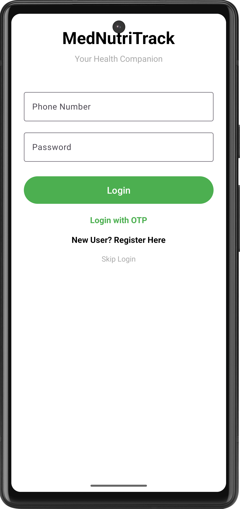 | 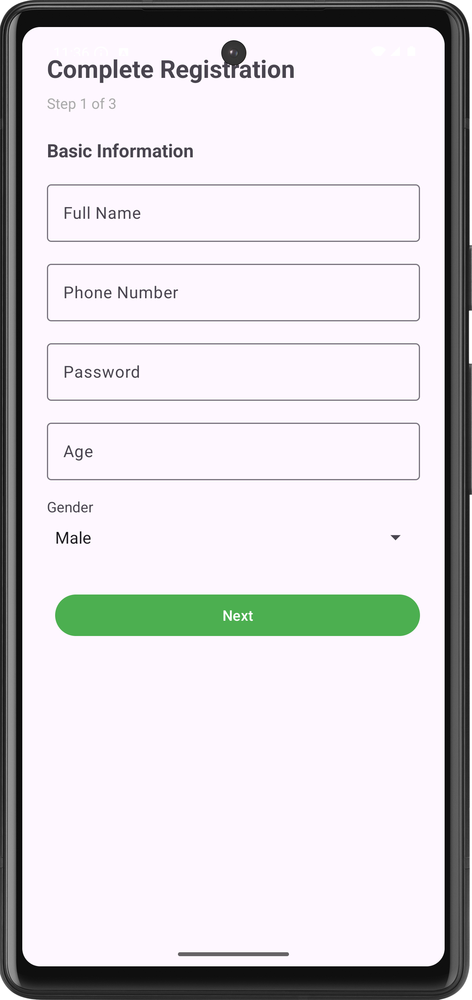 | 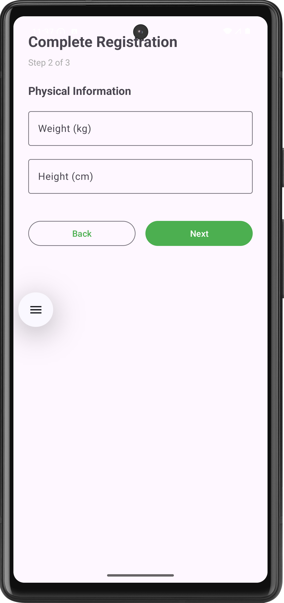 |

| Home | Medicines | Medicine by Voice |
|:---:|:---:|:---:|
| 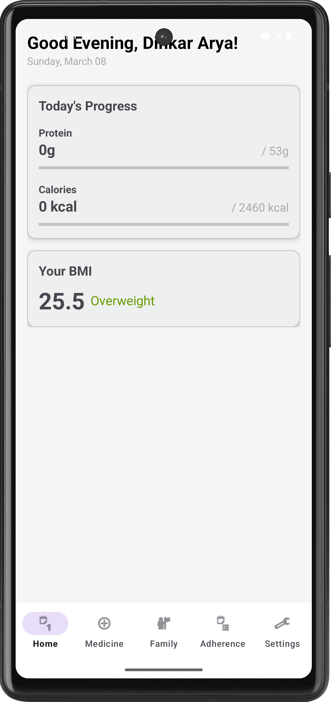 | 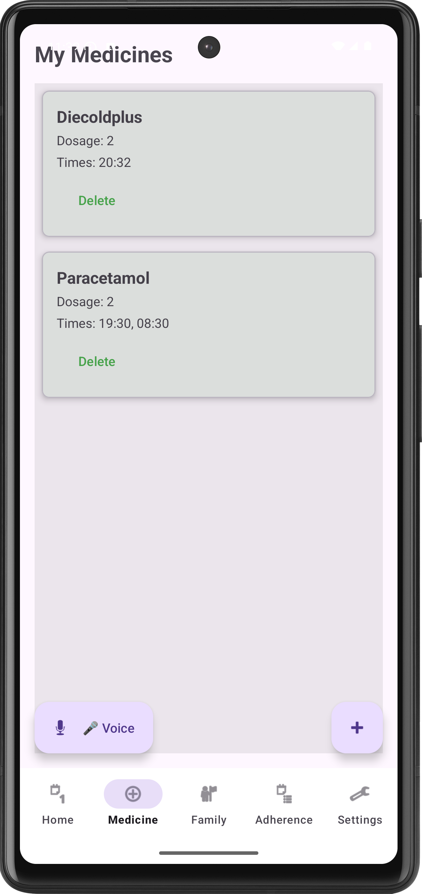 | 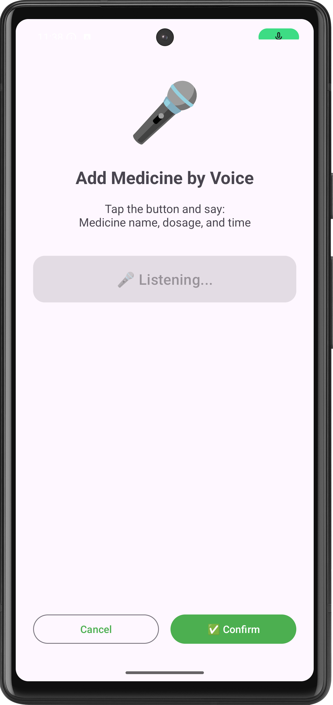 |

| Family Contacts | Adherence | Lifestyle Preference |
|:---:|:---:|:---:|
| 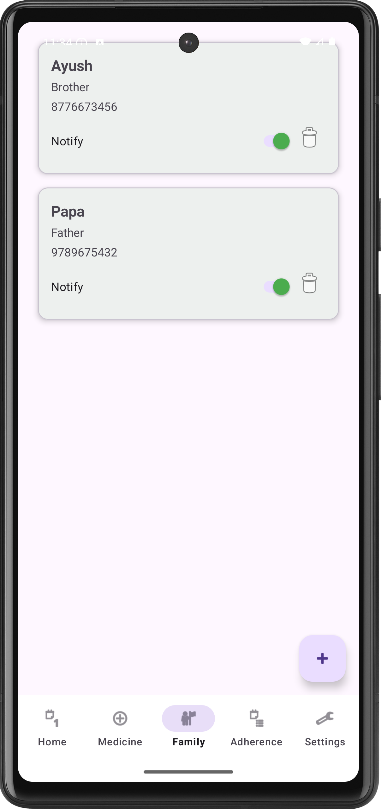 | 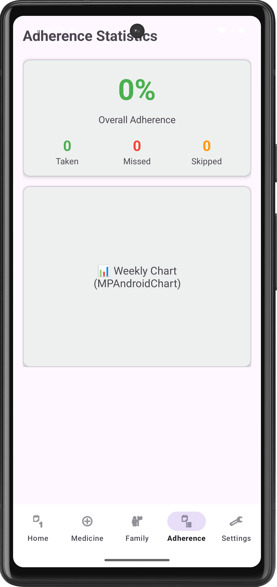 | 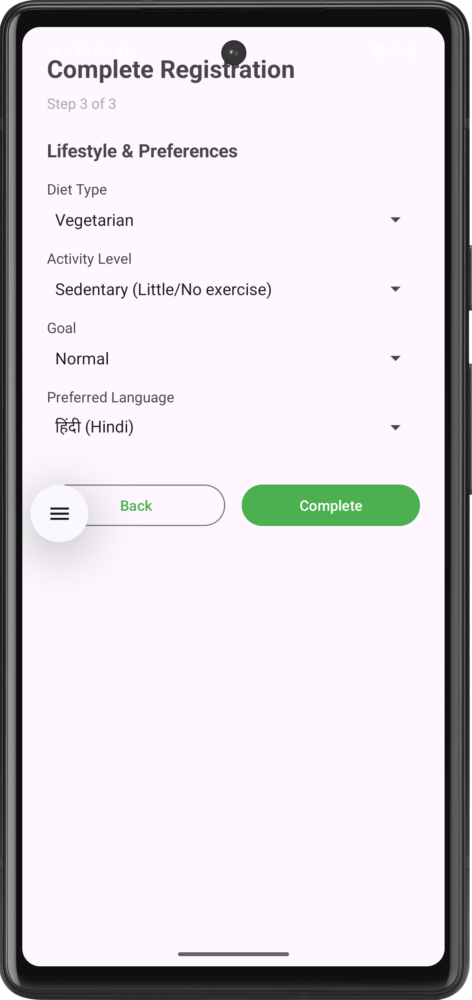 |

| User Profile | Edit Profile | Settings |
|:---:|:---:|:---:|
| 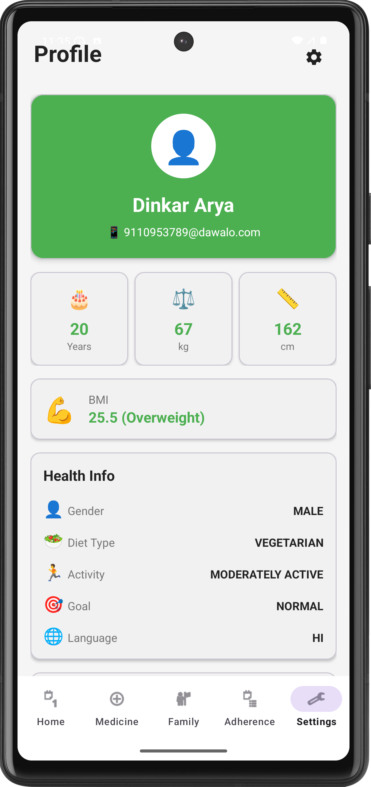 | 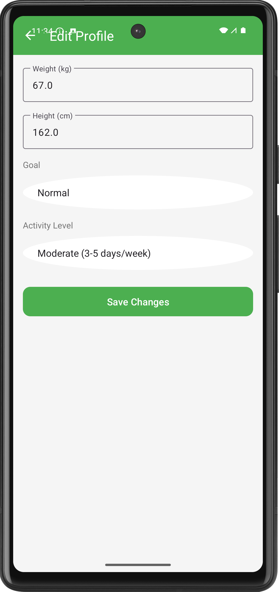 | 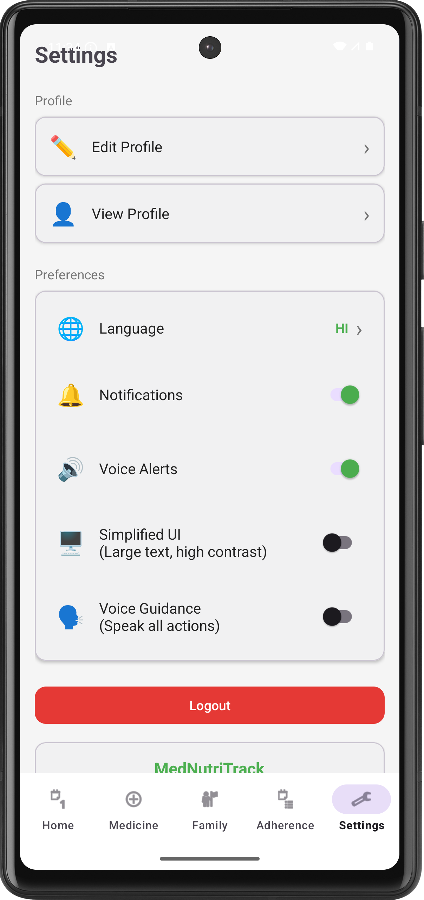 |

## Features

- **Medicine Reminders** — Dosage, frequency, multiple times. Exact alarms with push notifications and voice alerts (English/Hindi).
- **Nutrition Tracker** — Log food from Indian food database (14 items). Real-time protein calculation based on weight and goal.
- **Water Tracking** — Daily water intake logging.
- **Family Members** — Add and manage family member profiles.
- **Adherence Tracking** — Take/skip/miss status monitoring.
- **Full-Screen Alarm** — Alarm activity with take/skip actions.
- **Voice Input** — Add medicines via voice commands with NLP parsing.
- **Multi-Language** — English + Hindi. TTS speaks in selected language.
- **Offline-First** — Room DB local storage. Background sync via WorkManager (every 15 min).
- **OTP Login** — Phone-based auth. Test OTP `123456` works offline.

## Architecture

**Pattern**: MVVM + Repository + Offline-First Hybrid Sync

```
┌──────────────────────────────────────────────────┐
│              UI Layer (Activities/Fragments)       │
│  Auth | Home | Medicine | Nutrition | Water |     │
│  Profile | Family | Adherence | Settings | Alarm  │
└────────────────────┬─────────────────────────────┘
                     │
┌────────────────────▼─────────────────────────────┐
│              ViewModel Layer                      │
│  MedicineVM | NutritionVM | FamilyVM              │
└────────────────────┬─────────────────────────────┘
                     │
┌────────────────────▼─────────────────────────────┐
│           Repository / UseCase Layer              │
│  MedicineRepository | FamilyRepository |          │
│  LoginUseCase                                     │
└────────────────────┬─────────────────────────────┘
                     │
┌────────────────────▼─────────────────────────────┐
│              Data Layer                           │
│  Room DB (local) ←→ Retrofit (remote)             │
│  SyncManager + SyncWorker (background sync)       │
└──────────────────────────────────────────────────┘
```

User actions save to Room DB instantly (<10ms), then sync to backend in background.

## Project Structure

```
app/src/main/java/com/dp/dawalo/
├── MedNutriTrackApp.kt              # Application class
├── MainActivity.kt                   # Bottom nav host
├── AddMedicineActivity.kt           # Add medicine form
│
├── data/
│   ├── local/
│   │   ├── AppDatabase.kt          # Room database
│   │   ├── entity/                  # User, Medicine, MedicineLog, FoodItem,
│   │   │                            # DailyFoodLog, ProteinSummary, WaterLog, FamilyMember
│   │   └── dao/                     # UserDao, MedicineDao, MedicineLogDao, FoodItemDao,
│   │                                # DailyFoodLogDao, WaterLogDao, FamilyMemberDao
│   ├── remote/
│   │   ├── RetrofitClient.kt
│   │   ├── api/                     # AuthApi, MedicineApi, NutritionApi
│   │   └── dto/                     # ApiResponse, AuthDto
│   └── repository/                  # MedicineRepository, FamilyRepository
│
├── domain/usecase/                  # LoginUseCase
├── viewmodel/                       # MedicineVM, NutritionVM, FamilyVM + Factories
│
├── ui/
│   ├── auth/                        # Login, Register, OTP
│   ├── home/                        # HomeFragment
│   ├── medicine/                    # MedicineFragment, MedicineAdapter
│   ├── nutrition/                   # NutritionFragment, FoodLogAdapter
│   ├── water/                       # WaterFragment
│   ├── profile/                     # ProfileFragment, EditProfileActivity
│   ├── family/                      # FamilyFragment, FamilyAdapter
│   ├── adherence/                   # AdherenceFragment
│   ├── alarm/                       # MedicineAlarmActivity
│   ├── voice/                       # VoiceInputActivity
│   └── settings/                    # SettingsFragment, SettingsActivity
│
├── receiver/                        # MedicineAlarmReceiver, MedicineActionReceiver
├── service/                         # VoiceAlertService (TTS foreground)
├── sync/                            # SyncManager, SyncWorker
├── worker/                          # MissedMedicineChecker
└── utils/                           # PreferenceManager, IndianFoodDatabase, ProteinCalculator,
                                     # TTSHelper, AlarmScheduler, Converters, NotificationHelper,
                                     # LoadingHelper, MedicineParser, VoiceInputHelper
```

## Database Schema

| Table | Key Fields |
|-------|-----------|
| users | id, name, email, weight, goal, dailyProteinTarget, languageCode |
| medicines | id, userId, name, dosage, frequency, times (JSON), isActive, isSynced |
| medicine_logs | id, medicineId, status (taken/skipped/missed), timestamp |
| food_items | id, name, proteinPer100g (pre-populated Indian foods) |
| daily_food_logs | id, userId, foodName, protein, date, isSynced |
| water_logs | id, userId, amount, date |
| family_members | id, name, relation, phone |

## Tech Stack

- Kotlin, Min SDK 24, Target SDK 35
- Room 2.6.1, Retrofit 2.11.0, Coroutines 1.9.0
- Lifecycle (ViewModel + LiveData) 2.8.7
- WorkManager 2.10.0
- Material Design, ViewBinding
- MPAndroidChart 3.1.0, Shimmer 0.5.0, Gson 2.11.0

## Permissions

`POST_NOTIFICATIONS` · `SCHEDULE_EXACT_ALARM` · `USE_EXACT_ALARM` · `VIBRATE` · `INTERNET`

## How to Run

1. Open in Android Studio → Sync Gradle
2. Run on device/emulator (API 24+)
3. Register → Login with OTP (`123456` for testing)
4. Works fully offline — no backend required
